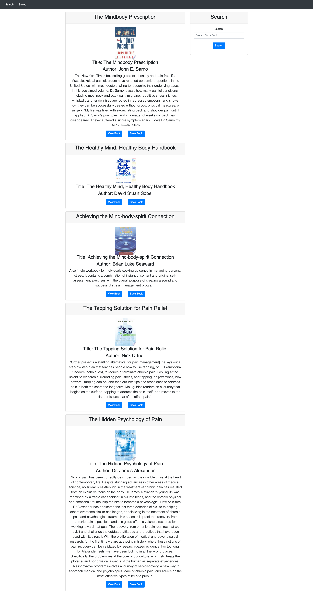

# Google Books Search

## Description 
This is a full-stack web application that allows searching, viewing and saving books retrieved using the Google Books API. It uses a MERN stack.

## Table of Contents (Optional)

* [Usage](#usage)
* [Credits](#credits)
* [License](#license)

## Usage 
* Access at: https://warm-meadow-63543.herokuapp.com/
* Screenshot: 

## Credits
* UoT FSF Bcamp - this template
* Code sourced an/or adapted from Week 19 - Activity #20
* Code sourced an/or adapted from Week 21 - Activity #4
* Code sourced an/or adapted from Week 21 - Activity #5
## License

MIT License

---
© 2019 Trilogy Education Services, a 2U, Inc. brand. All Rights Reserved.
